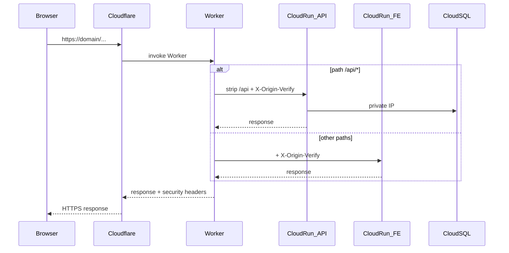

# Infrastructure

This document describes **what** production infrastructure is, **why** it is shaped this way,
and how to **operate** / **integrate** with it.

| Audience                 | Start here |
|--------------------------|------------|
| Application developers   | [URL and path contract](#url-and-path-contract) → [Prod env contract](#prod-env-contract) → [Shipping a code change](#shipping-a-code-change) → [Origin verify](#origin-verify-app-side) → [Logs](#application-logs-not-sentry) |
| Infrastructure engineers | [Architecture](#high-level-architecture) → [Resource inventory](#resource-inventory) → [IAM and trust](#iam-and-trust-boundaries) → [Networking](#networking-and-cloud-sql) → [Day-2 playbooks](#day-2-playbooks) → [Teardown](#teardown-and-blast-radius) |

**How-to deploy** (accounts, apply, images): [README.md](README.md).

Never commit `terraform.tfvars`, `backend.hcl`, API tokens, DSNs, passwords, or environment-specific `*.run.app` URLs.

Local development stays on Docker Compose (Caddy + Postgres). Production replaces that edge
and database with managed services; the same API and frontend container images are reused.

---

## Goals

| Goal                       | Approach                                                                      |
|----------------------------|-------------------------------------------------------------------------------|
| Cheap but production-ready | Cloud Run scale-to-zero; `db-f1-micro`; Free Cloudflare; budget emails only   |
| Simple edge                | Cloudflare Worker instead of GCP Global HTTPS LB / Cloud Armor                |
| Secure-enough origins      | Private Cloud SQL; shared `X-Origin-Verify` gate on API + frontend            |
| Reproducible               | Terraform for GCP + Cloudflare edge; secrets in gitignored `terraform.tfvars` |
| Local unchanged            | Compose graph stays Caddy + Postgres; prod knobs optional when unset          |

---

## High-level architecture

```
Browser
  → Cloudflare (TLS, DDoS edge, Worker)
       → /api/*  → Cloud Run API   → Cloud SQL (private IP, Direct VPC)
       → /*      → Cloud Run frontend
  → Sentry (optional, errors only)
```



| Piece      | Choice                                                                                        |
|------------|-----------------------------------------------------------------------------------------------|
| Compute    | Cloud Run (`matchmaker-api`, `matchmaker-frontend`), `min=0`, `max=2`, 512Mi / 1 CPU          |
| Database   | Cloud SQL Postgres 18 Enterprise (`db-f1-micro`), zonal, 10 GB SSD, no HA, private IP only |
| Networking | VPC + subnet + Private Service Access; API uses **Direct VPC egress** (`PRIVATE_RANGES_ONLY`) |
| Edge       | Cloudflare Free Worker + proxied apex DNS                                                     |
| Images     | Artifact Registry; build/push **manually** (`make gcp-push` / `gcp-deploy`)                   |
| Secrets    | Secret Manager → Cloud Run env; values supplied in `terraform.tfvars`                         |
| State      | GCS bucket (operator-created); Terraform remote backend                                       |
| Alerts     | Billing budgets $15 / $30 / $50 (email); uptime check on `/api/health` → email                |

**Not used / deferred:** GKE, GCE+Compose for prod, Serverless VPC Access connector, Cloud SQL public IP,
GCP Global HTTPS LB / Cloud Armor, GitHub Actions deploy / Workload Identity Federation,
billing auto-kill switch, HA SQL, staging project, Cloudflare paid rate limiting.
Reconsider those when you need multi-env CI deploy, stronger edge WAF, or SQL HA/RPO.

---

## Operator vs automation boundary

**Created manually (never automated by this repo):**

- Google Cloud account, billing account, GCP project
- Cloudflare account/zone (or access to an existing one), API token
- Sentry org/projects (optional)
- Discord developer application
- Local tools (`gcloud`, Terraform, Docker, `make`)
- GCS Terraform state bucket + IAM for your user

**Terraform provisions inside those accounts** using IDs and secrets you put in
`terraform.tfvars` / `backend.hcl`. It does not sign up for SaaS or create billing accounts.

**Who changes what:**

| Component | Owner | How to change |
|-----------|-------|----------------|
| VPC, SQL, Run shape, budgets, uptime, CF Worker/DNS route | Terraform          | Edit `.tf` / tfvars → `make infra-plan` → `make infra-apply` |
| Container image digests                                   | Manual / Make      | `make gcp-deploy` (TF `ignore_changes` on image)             |
| App code / OpenAPI                                        | App repo           | PR + rebuild images                                          |
| Discord app settings                                      | Discord console    | Manual (redirect URI)                                        |
| Sentry projects                                           | Sentry console     | Manual; DSNs in tfvars                                       |
| State bucket                                              | Operator bootstrap | `gcloud storage` (not in root module)                        |

---

## Local vs production

| Concern           | Local (Compose)                         | Production                                                                  |
|-------------------|-----------------------------------------|-----------------------------------------------------------------------------|
| Edge              | Caddy (`Caddyfile` strips `/api`)       | Cloudflare Worker (same path contract)                                      |
| Database          | Postgres container                      | Cloud SQL private IP                                                        |
| Origin verify     | `ORIGIN_VERIFY_SECRET` unset → off      | Worker injects header; API + frontend enforce                               |
| `DB_MAX_CONNS`    | unset → pgx default                     | Terraform sets `5` on API                                                   |
| `TRUSTED_PROXIES` | default `172.20.0.0/16`                 | `0.0.0.0/0` on Cloud Run (platform + CF `X-Forwarded-For`)                  |
| Sentry            | DSN unset → no init                     | Optional DSNs from Secret Manager                                           |
| Images            | Compose build                           | Artifact Registry digests updated outside Terraform                         |
| Migrations        | goose on API start (AUTO_MIGRATE unset) | `AUTO_MIGRATE=false`; Job as `matchmaker_migrator`; API as `matchmaker_app` |

Prod-only env vars must not be required for `make dev`.

**Prod-only bugs to watch when developing locally:** origin-verify 403s if you hit `*.run.app` directly; baked `NEXT_PUBLIC_*` wrong after domain change (rebuild frontend); Discord redirect / cookie domain mismatch; cold start delaying OAuth (`oauth_state` cookie MaxAge **900s**).

---

## Resource inventory

Names use prefix `matchmaker` (`local.name_prefix`). Region defaults to `us-central1`.

| Resource             | Name / ID pattern                                                           |
|---------------------|-----------------------------------------------------------------------------|
| VPC                  | `matchmaker-vpc`                                                            |
| Subnet               | `matchmaker-subnet` (`10.10.0.0/24`)                                        |
| PSA reserved range   | `matchmaker-psa` (/16)                                                      |
| Artifact Registry    | `matchmaker-docker` → `{region}-docker.pkg.dev/{project}/matchmaker-docker` |
| Cloud SQL instance   | `matchmaker-pg`                                                             |
| SQL database / roles | DB `matchmaker`; roles `postgres`, `matchmaker_app`, `matchmaker_migrator` (legacy `matchmaker` until bootstrapped) |
| Cloud Run API        | `matchmaker-api`                                                            |
| Cloud Run migrate    | `matchmaker-migrate` (Job; `server migrate` as `matchmaker_migrator`)       |
| Cloud Run bootstrap  | `matchmaker-db-bootstrap` (Job; `server db-bootstrap` as `postgres`)        |
| Cloud Run frontend   | `matchmaker-frontend`                                                       |
| Runtime SA API       | `matchmaker-api@{project}.iam.gserviceaccount.com`                          |
| Runtime SA frontend  | `matchmaker-frontend@{project}.iam.gserviceaccount.com`                     |
| Worker               | `matchmaker-edge`                                                           |
| Worker route         | `{domain}/*`                                                                |
| Secrets              | `matchmaker-db-admin-password`, `matchmaker-db-app-password`, `matchmaker-db-migrator-password`, `matchmaker-database-url`, `matchmaker-database-url-migrate`, `matchmaker-database-url-admin`, jwt/cookie/origin/discord, optional Sentry |

**Terraform outputs** (contract after apply): `artifact_registry_url`, `cloud_run_api_uri`, `cloud_run_frontend_uri`, `cloud_run_api_name`, `cloud_run_frontend_name`, `cloud_sql_connection_name`, `cloud_sql_private_ip` (sensitive), `vpc_network`.

Do **not** use `cloud_run_*_uri` (`*.run.app`) as the app’s public base URL in clients,
Discord redirects, or user-facing config — use `https://{domain}` only. Those origin URLs
are operator outputs for debugging/Worker bindings, not a product endpoint. This repo is
public: documenting the *pattern* is fine; never commit real project URLs, tokens, or
`terraform.tfvars` / `backend.hcl`.

---

## Terraform layout

Root module under [`terraform/`](terraform/) (single prod environment; no Terragrunt):

| File                                        | Responsibility                                      |
|---------------------------------------------|-----------------------------------------------------|
| `versions.tf` / `providers.tf`              | TF `>= 1.6, < 2`; Google/Cloudflare `~> 6` / `~> 4` |
| `backend.tf` + `backend.hcl`                | GCS remote state                                    |
| `variables.tf` / `locals.tf` / `outputs.tf` | Inputs, naming, exports                             |
| `apis.tf`                                   | Enable required Google APIs                         |
| `networking.tf`                             | VPC, subnet, PSA                                    |
| `artifact_registry.tf`                      | Docker repo                                         |
| `iam.tf`                                    | Runtime SAs + `run.invoker` for `allUsers`          |
| `secrets.tf`                                | Secret Manager from tfvars                          |
| `cloud_sql.tf`                              | Private Postgres                                    |
| `cloud_run.tf`                              | API + frontend                                      |
| `cloudflare.tf`                             | Worker, route, apex DNS                             |
| `budgets.tf` / `monitoring.tf`              | Budgets + uptime email                              |
| `terraform.tfvars.example`                  | Documented inputs                                   |

Common labels: `app=matchmaker`, `env=prod`, `managed_by=terraform`.

**Provider upgrades:** bump constraints in `versions.tf`, run `terraform init -upgrade` in a branch, `plan` carefully (Cloudflare Worker / Google Run APIs change). Prefer pessimistic `~>` pins; do not jump major providers without reading changelogs.

---

## IAM and trust boundaries

### Runtime (Terraform-managed)

| Identity                        | Roles                                                         | Why                                                         |
|---------------------------------|---------------------------------------------------------------|-------------------------------------------------------------|
| `matchmaker-api` SA             | `roles/cloudsql.client`, `roles/secretmanager.secretAccessor` | Connect to SQL; read secrets                                |
| `matchmaker-frontend` SA        | `roles/secretmanager.secretAccessor`                          | Read origin-verify / optional Sentry DSN                    |
| `allUsers` on both Run services | `roles/run.invoker`                                           | Public HTTPS invoke (Cloudflare is not identity-aware here) |

App SAs intentionally have **no** access to the Terraform state bucket.

### Operator (manual)

- Your Google user (ADC) runs Terraform — typically project **Owner** (or equivalent apply roles) plus bucket `roles/storage.objectAdmin` on the state bucket.
- Cloudflare custom API token: Account Workers Scripts Edit, Zone Workers Routes Edit, Zone DNS Edit (scoped to the zone/account).

### Trust model (short)

| Surface                                    | Trust                                                                  |
|--------------------------------------------|------------------------------------------------------------------------|
| Public internet → Cloudflare               | TLS + CF edge; Free-tier DDoS basics                                   |
| Cloudflare Worker → Cloud Run              | Shared secret header `X-Origin-Verify`                                 |
| Cloud Run → Cloud SQL                      | Private VPC only; no public SQL IP                                     |
| Direct `*.run.app` without secret          | Rejected by app (403) when secret set                                  |
| Attacker who steals `ORIGIN_VERIFY_SECRET` | Can call origins as the Worker would — rotate secret in tfvars + apply |
| Cloud Run probes `/health`                 | Exempt from origin-verify                                              |

`allUsers` invoker means any client that can reach `*.run.app` may invoke Cloud Run.
**Origin-verify** is the access control for application traffic, not URL secrecy. A public
repo can describe that model; do not treat “people might not find the hostname” as
security. Still prefer `{domain}` everywhere user-facing so traffic stays on the Worker path
(correct headers, TLS policy, logging).

---

## Networking and Cloud SQL

- **VPC** `matchmaker-vpc`, **subnet** `10.10.0.0/24`, same region as Run/SQL.
- **PSA** reserved range `matchmaker-psa` (/16) + `google_service_networking_connection` for Cloud SQL private IP.
- Cloud SQL: Enterprise edition (required for `db-f1-micro`; PG16+ otherwise defaults to Enterprise Plus), `ipv4_enabled = false`, deletion protection on, 7-day automated backups, **PITR off**, disk autoresize off.
- **API Cloud Run** Direct VPC egress `PRIVATE_RANGES_ONLY`: traffic to private RFC1918 (including SQL) goes via the VPC. Public internet calls from the API (Discord OAuth, Sentry) still use Cloud Run’s normal egress path for non-private destinations — not forced through a NAT on this connectorless setup.
- Frontend has **no** VPC attachment.
- `DATABASE_URL`: `postgres://matchmaker:…@PRIVATE_IP:5432/matchmaker?sslmode=disable` (private path).
- **Migrations:** local/dev runs goose on API start (`AUTO_MIGRATE` unset). Production sets `AUTO_MIGRATE=false` and applies schema via Cloud Run Job `matchmaker-migrate` as role **`matchmaker_migrator`** (DDL+DML). API connects as **`matchmaker_app`** (DML only). Bootstrap once with `make gcp-db-bootstrap` (`server db-bootstrap` as `postgres`).
- **Admin access to SQL:** use Cloud SQL Studio / Auth Proxy as **`postgres`** (`db_admin_password`). Prefer export/backup APIs for dumps.
- **Connection budget:** `DB_MAX_CONNS=5` × `max_instances=2` ⇒ ≤ ~10 app pool connections vs `db-f1-micro` limits — do not raise both casually.

---

## Cloud Run

Both services:

- `min_instance_count = 0`, `max_instance_count = 2` (variable).
- HTTP startup probes on `/health` (no liveness probes — keeps request-based billing). Cloud Run ignores Docker `HEALTHCHECK`.
- First apply may use placeholder image `us-docker.pkg.dev/cloudrun/container/hello`.
- `lifecycle.ignore_changes` on container **image** (and client metadata) so manual digests survive re-apply.
- Ports: API `8080`, frontend `3000`.

**Cold start:** first request after idle can take seconds. OAuth `oauth_state` cookie is **900 seconds** to tolerate a slow Discord round-trip during cold start; still rare to need `min_instances=1`.

**Drift:** editing the service image or env in the Cloud Console may diverge from Terraform. Image is ignored by TF; other console edits can be reverted on next apply. Prefer tfvars/Make for changes.

---

## Secrets

Operator-supplied in `terraform.tfvars` (not `random_*`):

| Variable                                 | Used for                                                                                         |
|------------------------------------------|--------------------------------------------------------------------------------------------------|
| `db_admin_password`                      | Cloud SQL `postgres` user; Studio / `db-bootstrap` only                                          |
| `db_migrator_password`                   | SQL role `matchmaker_migrator` (migrate Job; DDL+DML)                                            |
| `db_app_password`                        | SQL role `matchmaker_app` (API DML-only); also legacy `matchmaker` until `db_roles_bootstrapped` |
| `db_roles_bootstrapped`                  | `false` until after `make gcp-db-bootstrap`; then `true`                                         |
| `jwt_secret`                             | API JWT (64 hex)                                                                                 |
| `cookie_hash_key` / `cookie_encrypt_key` | Securecookie (64 hex each)                                                                       |
| `api_link_encryption_key`                | AES-256 for `api_links` refresh tokens (64 hex; do not reuse `cookie_encrypt_key`)               |
| `api_link_encryption_key_id`             | Current key id written to `api_links.key_id` (default `1`)                                       |
| `api_link_encryption_previous_keys`      | Optional `id:hex` list of retired keys (Secret Manager when non-empty)                           |
| `origin_verify_secret`                   | Worker + API + frontend                                                                          |
| `discord_client_secret`                  | OAuth                                                                                            |
| `sentry_dsn_api` / `sentry_dsn_frontend` | Optional                                                                                         |

Also non-secret but sensitive-ish: `cloudflare_api_token`, Discord client ID, billing IDs.

Generate hex keys with `make gen-keys` or `openssl rand -hex 32`.

Values go to Secret Manager and into **Terraform state**. Keep the state bucket private.

### DB roles (production)

| Role                  | Consumer                 | Rights                                      |
|-----------------------|--------------------------|---------------------------------------------|
| `postgres`            | Operator / bootstrap Job | Cloud SQL admin (`cloudsqlsuperuser`)       |
| `matchmaker_migrator` | `matchmaker-migrate` Job | DDL + DML; owns migrated objects            |
| `matchmaker_app`      | `matchmaker-api`         | DML + sequence usage; no DDL / `CREATEROLE` |

Local Compose is unchanged (single `POSTGRES_USER`).

### Secret rotation (high level)

1. Update value in `terraform.tfvars`.
2. `make infra-plan` / `apply` — new Secret Manager versions; `postgres` password updates via `google_sql_user.postgres`; app/migrator passwords require re-running **`make gcp-db-bootstrap`** (SQL `ALTER ROLE`) after the secret versions exist, then recycle migrate Job / API.
3. Cloud Run picks up `latest` on new revisions — force a new revision if needed.
4. **JWT / cookie key rotation** invalidates existing sessions — users re-login.
5. Keep app vs migrator vs admin passwords distinct.
---

## Cloudflare Worker

Script: [`cloudflare/worker.js`](cloudflare/worker.js). Production stand-in for local Caddy.

### Behavior

1. **Path routing** — `/api` or `/api/*` → `API_ORIGIN`, strip `/api`. Else → `FRONTEND_ORIGIN`.
2. **Origin verify** — Set `X-Origin-Verify`; strip from response.
3. **Client IP** — `CF-Connecting-IP` → `X-Forwarded-For`.
4. **Proxy** — method/body; `redirect: manual`.
5. **Headers** — `X-Content-Type-Options`, `Referrer-Policy`, `X-Frame-Options` (no strict CSP).

Terraform also creates Worker bindings, route `{domain}/*`, and proxied apex `AAAA 100::`.

### Shared Cloudflare zone

Before apply: check existing apex A/AAAA/CNAME and Worker routes. Conflicts need import, temporary click-ops, or coordinating with the zone owner. Automating the Worker keeps secrets/origins aligned with GCP; click-ops drifts.

**Free-tier note:** Worker subrequest limits exist — at Matchmaker’s low traffic this is fine; watch CF analytics if you grow.

---

## URL and path contract

| URL                                          | Purpose                                                |
|----------------------------------------------|--------------------------------------------------------|
| `https://{domain}/`                          | Frontend (Next.js)                                     |
| `https://{domain}/about`                     | Public About & Privacy page (logged-in and logged-out) |
| `https://{domain}/api/...`                   | API (Worker strips `/api` before Cloud Run)            |
| `https://{domain}/api/health`                | Public API health (uptime check)                       |
| `https://{domain}/health`                    | Frontend static health                                 |
| `https://{domain}/api/auth/discord_redirect` | Discord OAuth redirect                                 |
| `https://{domain}/auth/callback`             | Frontend OTC exchange page                             |

Clients must use **`NEXT_PUBLIC_API_URL=https://{domain}/api`** (bake-time). Do not point
browsers at `*.run.app` (bypasses the Worker; requests fail origin-verify unless the secret
is sent, which browsers must not have).

Same path contract as local Caddy: do not double-prefix `/api` in server routes (Gin serves `/health`, `/auth/...`, not `/api/health`).

---

## Prod env contract

### API (Cloud Run runtime)

| Name                                     | Source                                       |
|------------------------------------------|----------------------------------------------|
| `PORT`                                   | set by Cloud Run from container port `8080`  |
| `GIN_MODE`                               | `release`                                    |
| `FRONTEND_URL`                           | `https://{domain}`                           |
| `COOKIE_DOMAIN`                          | `{domain}`                                   |
| `DISCORD_CLIENT_ID`                      | tfvars                                       |
| `DISCORD_REDIRECT_URI`                   | `https://{domain}/api/auth/discord_redirect` |
| `DB_MAX_CONNS`                           | `5`                                          |
| `TRUSTED_PROXIES`                        | `0.0.0.0/0`                                  |
| `DATABASE_URL`                           | Secret Manager                               |
| `JWT_SECRET`                             | Secret Manager                               |
| `COOKIE_HASH_KEY` / `COOKIE_ENCRYPT_KEY` | Secret Manager                               |
| `API_LINK_ENCRYPTION_KEY`                | Secret Manager                               |
| `API_LINK_ENCRYPTION_KEY_ID`             | tfvars (default `1`)                         |
| `API_LINK_ENCRYPTION_PREVIOUS_KEYS`      | optional Secret Manager                      |
| `DISCORD_CLIENT_SECRET`                  | Secret Manager                               |
| `ORIGIN_VERIFY_SECRET`                   | Secret Manager                               |
| `SENTRY_DSN`                             | optional Secret Manager                      |

### Frontend (Cloud Run runtime)

| Name                   | Source                         |
|------------------------|--------------------------------|
| `PORT` / `HOSTNAME`    | Cloud Run → `3000` / `0.0.0.0` |
| `ORIGIN_VERIFY_SECRET` | Secret Manager                 |
| `SENTRY_DSN`           | optional Secret Manager        |

### Frontend (bake-time — rebuild image to change)

| Name                                   | Typical prod value                           |
|----------------------------------------|----------------------------------------------|
| `NEXT_PUBLIC_API_URL`                  | `https://{domain}/api`                       |
| `NEXT_PUBLIC_FRONTEND_DOMAIN`          | `{domain}`                                   |
| `NEXT_PUBLIC_COOKIE_AUTH_EXPIRE_LIMIT` | `604800` (match refresh TTL)                 |
| `NEXT_PUBLIC_FEEDBACK_URL`             | GitHub Issues URL (override for a form/etc.) |

---

## Origin verify (app side)

When `ORIGIN_VERIFY_SECRET` is set:

- **API** — Gin middleware after RequestLogger; `GET /health` exempt; wrong/missing → 403.
- **Frontend** — [`frontend/src/proxy.ts`](../frontend/src/proxy.ts); `/health` exempt; `/auth/callback` and `/about` are **not** excluded from the matcher (verify runs) but **skip** the logged-out redirect (`/auth/callback` so Discord OAuth can finish; `/about` is a public marketing page for both auth states).
- When unset (local) — no-op.

Chain: `RequestID → Recovery → RequestLogger → OriginVerify → CORS` (+ Auth on protected routes).

**Do not** add auth or origin-verify requirements to `/health` — probes and uptime depend on it.

---

## OAuth and cookies

- Discord redirect must match `DISCORD_REDIRECT_URI` exactly.
- CORS allow-origin is `FRONTEND_URL` (`https://{domain}`).
- Cookie domain is `{domain}` (no leading dot required in our config).
- `oauth_state` MaxAge = **900** seconds (CSRF during Discord round-trip; sized for Cloud Run cold starts).
- Refresh / `auth_session` lifetime follows `REFRESH_EXPIRE_LIMIT` / `NEXT_PUBLIC_COOKIE_AUTH_EXPIRE_LIMIT` (default 7 days).

Changing domain ⇒ update Discord console, tfvars `domain`, rebuild frontend `NEXT_PUBLIC_*`, re-apply Terraform.

---

## Observability and cost controls

| Control          | Notes                                                                 |
|------------------|-----------------------------------------------------------------------|
| Application logs | Cloud Logging (stdout/stderr) — see below                             |
| Sentry           | Errors only (`TracesSampleRate: 0`); two projects (Go/Gin + Next.js)  |
| Uptime           | `https://{domain}/api/health` every 5m from USA (3 locations) → email |
| Budgets          | $15 / $30 / $50 email only — no kill switch                           |
| Caps             | `max_instances=2`, fixed SQL disk, no HA                              |

Typical idle **~$10–15/month** (mostly Cloud SQL).

### Application logs (not Sentry)

API: structured JSON `slog` to stdout (`release` → Info+). Cloud Run → Cloud Logging. Frontend: Node stdout/stderr (thinner than API).

**Console:** Cloud Run → service → **Logs**, or Logging → Logs Explorer.

```text
resource.type="cloud_run_revision"
resource.labels.service_name="matchmaker-api"
```

**CLI:**

```bash
gcloud run services logs read matchmaker-api --region=us-central1 --limit=50
gcloud logging read \
  'resource.type="cloud_run_revision" AND resource.labels.service_name="matchmaker-api"' \
  --limit=50 --format=json
```

Correlate with `request_id` on API `request completed` lines (`method`, `path`, `status`, `duration_ms`, …).

---

## Image deploy model

1. Terraform creates services (possibly placeholder image).
2. Build **linux/amd64**, push to AR, update Cloud Run digests (`make gcp-deploy`).
3. Re-`apply` is safe for infra; images ignored by Terraform.

No GHA deploy / WIF in this phase. App test CI unchanged.

---

## Shipping a code change

1. Merge app changes as usual.
2. From repo root (set `GCP_PROJECT`, `DOMAIN` for public hostname):

```bash
make gcp-deploy GCP_PROJECT=your-project DOMAIN=matchmaker.games
```

3. Smoke:

```bash
curl -sS https://matchmaker.games/api/health
curl -sS https://matchmaker.games/health
# Discord login once if auth/cookie code changed
```

4. Watch logs (above) for 5xx / unexpected 403s.

**Frontend-only public URL change:** rebuild with new `NEXT_PUBLIC_*` build-args (not a runtime env tweak).

**Infra-only change:** `make infra-plan` → `make infra-apply` — does not replace images.

---

## Day-2 playbooks

| Change                                   | Steps                                                                    |
|------------------------------------------|--------------------------------------------------------------------------|
| App bugfix / feature                     | `make gcp-deploy`                                                        |
| Scale / CPU / memory / max instances     | tfvars or `cloud_run.tf` → plan/apply                                    |
| Rotate origin-verify / JWT / DB password | Update tfvars → plan/apply → confirm Run/Worker; re-login if JWT/cookies |
| Worker logic                             | Edit `cloudflare/worker.js` → plan/apply                                 |
| Domain change                            | Discord + tfvars `domain` + frontend rebuild + apply + DNS               |
| SQL disk / tier                          | variables → plan/apply (expect downtime risk on tier change)             |
| Shared CF zone conflict                  | Pause apply; reconcile DNS/routes; import or remove conflicting records  |

---

## Failure modes (quick)

| Symptom                                | Likely hop                                                                           |
|----------------------------------------|--------------------------------------------------------------------------------------|
| 403 on `*.run.app`                     | Origin-verify (expected without header)                                              |
| 403 via public domain                  | Worker secret ≠ app secret; or frontend proxy rejecting                              |
| 502 / error from CF                    | Worker → Run unreachable; Run not ready; wrong origin URL binding                    |
| Uptime failing, curl health OK locally | CF/DNS; SSL mode; Worker route                                                       |
| Discord login fails after redirect     | Redirect URI / cookie domain / `FRONTEND_URL`; or `oauth_state` expired (cold start) |
| `invalid timezone` on events           | Scratch API image had no zoneinfo — embed `time/tzdata` (redeploy API)               |
| API crash loops                        | bad `DATABASE_URL`; secret access; missing schema (forgot `make gcp-migrate`)        |
| `permission denied` on SQL             | Wrong DSN role; forgot `gcp-db-bootstrap` or `db_roles_bootstrapped` flip            |
| Migrate job fails                      | Job image still placeholder; Direct VPC / SQL; bad migrator `DATABASE_URL`          |
| “Still on hello” / probe fail          | Placeholder image — push real images                                                 |

---

## State bucket IAM

Cloud Run does **not** use the state bucket. Bootstrap versioned GCS; grant your user
`roles/storage.objectAdmin` on that bucket only. Details: [README.md](README.md) Phase 1.

---

## Teardown and blast radius

**Destroy removes (via Terraform):** VPC/SQL/Run/AR/secrets versions managed by the module,
Worker script/route/apex record Terraform owns, budgets/uptime resources.

**Survives unless you delete manually:** GCS state bucket, GCP project/billing, Cloudflare
zone/account, Discord app, Sentry org, any DNS records not in state.

**Order:** export DB if needed → set SQL `deletion_protection = false` and apply →
`make infra-destroy` → delete state bucket last → verify billing.

---

## Quotas and limits (practical)

| Limit                       | Implication                                          |
|-----------------------------|------------------------------------------------------|
| Cloud Run `max_instances=2` | Hard concurrency/cost cap                            |
| `DB_MAX_CONNS=5`            | Caps DB pressure with max instances                  |
| `db-f1-micro`               | Shared CPU; fine for low traffic                     |
| CF Worker free tier         | Enough for small user base; monitor if traffic grows |
| Logging volume              | Low at this scale; still billed if logs explode      |

---

## Locked decisions (summary)

1. **Private Cloud SQL only** — Direct VPC on API, not VPC Access connector.
2. **No billing kill switch** — budget emails only.
3. **State bucket** — operator IAM only.
4. **Idempotent apply** — placeholder image + `ignore_changes` on images.
5. **Origin verify on API and frontend**.
6. **Account creation is manual**.
7. **Secrets in `terraform.tfvars`** — not random resources.

---

## Related files

| Path                                                                                               | Role                                          |
|----------------------------------------------------------------------------------------------------|-----------------------------------------------|
| [README.md](README.md)                                                                             | From-zero runbook                             |
| [cloudflare/worker.js](cloudflare/worker.js)                                                       | Edge Worker source                            |
| [terraform/](terraform/)                                                                           | IaC root module                               |
| [../frontend/src/proxy.ts](../frontend/src/proxy.ts)                                               | Frontend origin-verify + route guard          |
| [../backend/internal/middleware/origin_verify.go](../backend/internal/middleware/origin_verify.go) | API origin-verify                             |
| [../Caddyfile](../Caddyfile)                                                                       | Local edge (path contract mirrored by Worker) |
